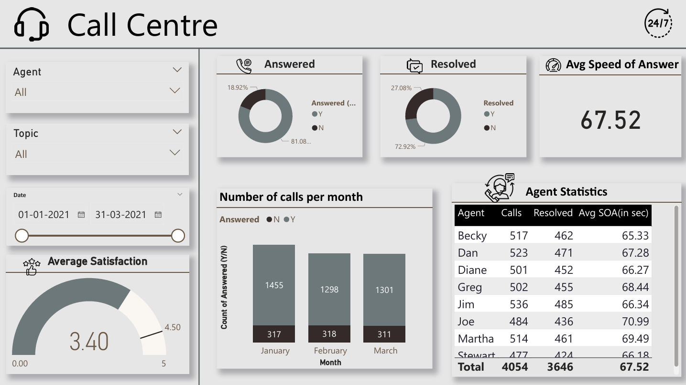

# Call Center Performance Dashboard 

**Objective**: Build an interactive dashboard in Power BI to analyze call center KPIs, monitor agent efficiency, and identify factors affecting customer satisfaction.  

**Dataset**: Call records including agent, topic, date/time, answered status, resolved status, speed of answer, talk duration, and satisfaction rating.  

**Tools Used**: Power BI, DAX.  

---

## Key Insights
- **Answer rate**: 81% of total calls were answered.  
- **Resolution rate**: 73% of calls were resolved, with variation across agents.  
- **Average Speed of Answer (SOA)**: ~67 seconds overall, slower for some agents (Joe & Martha).  
- **Customer Satisfaction**: Average = 3.4/5, below ideal benchmark of 4.5.  
- **Monthly Trend**: Call volume remained steady across Jan–Mar with a dip in February.  
- **Agent Analysis**: Top agents (Dan & Becky) showed high resolution rates and faster SOA.  

---

## Dashboard Overview

---

## Project Files
- [CallCenterDashboard.pbix](reports/Call_Center.pbix) – The source Power BI file, allowing for a full review of the data model, DAX calculations, and report design.
- [CallCenterDashboard.pdf](reports/Call_Center_Dashboard.pdf) – A static, printable version of the final dashboard for quick reference. 
-  – A high-resolution image of the dashboard for quick viewing.  
- [Dataset](dataset/Call-Center-Dataset.xlsx) – The cleaned and prepared dataset used for this analysis. 

---

## Future Enhancements

- Add predictive analytics for call volume and agent workload  
- Integrate live call center data  
- Perform sentiment analysis on customer feedback  

---

**Contact**: Aswathi U K  
- LinkedIn: [https://www.linkedin.com/in/aswathi-uk](https://www.linkedin.com/in/aswathi-uk-auk034/)  
- GitHub: [https://github.com/aswathiuk](https://github.com/Aswathiuk)  
